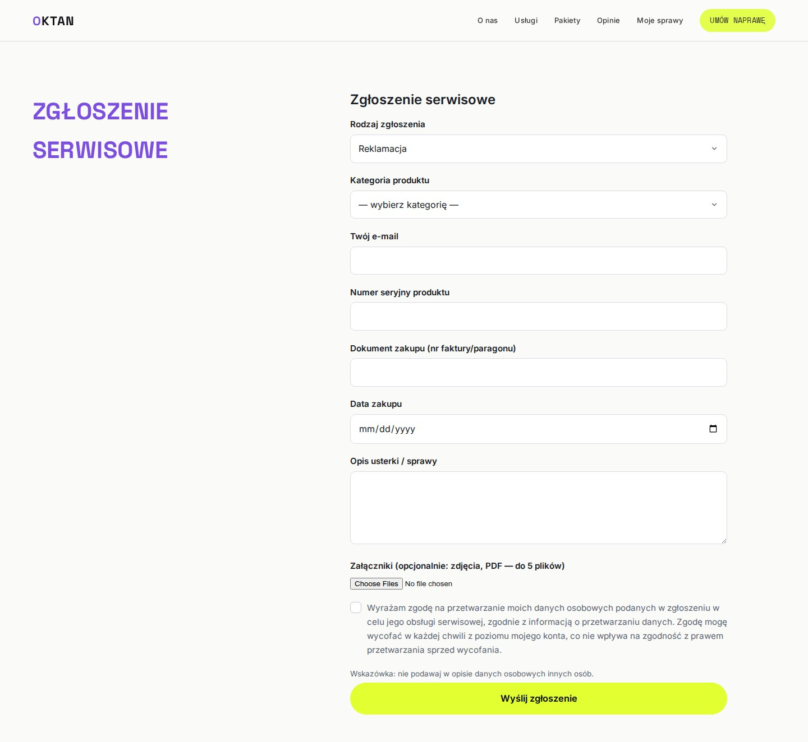
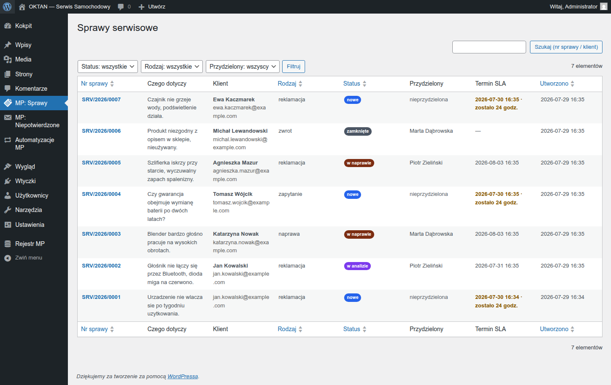
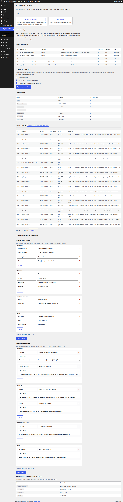

# MP Service Suite

[](https://github.com/szydlowskikonrad95-art/mp-service-suite/actions/workflows/quality.yml)
[](https://github.com/szydlowskikonrad95-art/mp-service-suite/releases/latest)
[](LICENSE)
[](#wymagania)
[](#wymagania)

System obsługi zgłoszeń serwisowych i reklamacyjnych dla firmy MP — **trzy współpracujące,
ale niezależne wtyczki WordPress**:

> **Chcesz tylko zainstalować?** Pobierz paczkę z **[najnowszego wydania](https://github.com/szydlowskikonrad95-art/mp-service-suite/releases/latest)**
> i zacznij od pliku `INSTRUKCJA-KLIENTA.md` w środku — prowadzi krok po kroku, bez wiedzy
> programistycznej. Reszta tego dokumentu opisuje system od strony technicznej.

| Wtyczka | Rola | Najkrócej |
|---|---|---|
| **MP Service Intake** | recepcja | formularz zgłoszeń (4 rodzaje, pola wg kategorii), numery spraw `SRV/RRRR/NNNN`, weryfikacja mailowa, konto klienta bez hasła (magic-link), wiadomości klient↔serwis, RODO |
| **MP Warranty & Serial Registry** | magazyn wiedzy | rejestr produktów/numerów seryjnych/partii, import CSV porcjami z raportem błędów, poprawianie danych produktu z historią zmian, automatyczny status gwarancji, wyjątki gwarancyjne za zgodą admina, wyszukiwarka |
| **MP Workflow Automator** | kierownik | reguły przydziału (kategoria, priorytet — pola „kraj" i „język" **nie zadziałają**, bo produkt tych danych nigdzie nie zbiera), 7 statusów wbudowanych (nieusuwalnych) **plus statusy własne dodawane w panelu**, godziny terminów ustawiane w panelu, maile po ważnych zmianach, SLA z przypomnieniem i eskalacją, checklisty, raporty CSV |

Dane żyją w **16 dedykowanych tabelach** (nie we wpisach WP) z twardymi zasadami integralności:
unikalny numer sprawy nadawany przez bazę, nieusuwalna oś zdarzeń każdej sprawy, blokada archiwizacji
produktu z aktywną sprawą (produktów nie usuwa się na twardo — trafiają do archiwum), migracje wersjonowane z możliwością odtworzenia. Szczegóły i uzasadnienie
każdej tabeli: [`dokumentacja-techniczna/DATABASE.md`](dokumentacja-techniczna/DATABASE.md).

## Wymagania

WordPress 6.x · PHP 8.1–8.5 (CI testuje każdą wersję) · MySQL 8 / MariaDB 10.6+.

## Szybki start

1. Zainstaluj i aktywuj trzy ZIP-y z [Releases](../../releases) — **kolejność dowolna**: każda
   wtyczka działa też sama i ogranicza funkcje, gdy braci nie ma — zamiast błędu pokazuje komunikat.
2. Aktywacja Intake sama tworzy strony **formularza zgłoszenia** i **panelu klienta** oraz role:
   *administrator systemu MP*, *koordynator serwisu*, *pracownik serwisu*, *klient*.
3. Zajrzyj do **Narzędzia → Stan witryny** — czternaście testów diagnostycznych mówi, czego
   brakuje na hostingu (fileinfo, biblioteka obrazów, HTTPS, nadawca poczty, cron…) i **jak to
   naprawić** — łącznie z tym, czy automatyzacja realnie się wykonuje, a nie tylko jest zaplanowana.
4. W Rejestrze zaimportuj produkty z CSV (na ekranie importu jest przykładowy plik do pobrania).
5. W Automatorze (**Automatyzacje MP → Ustawienia**) uzupełnij **pulę pracowników** reguły przydziału
   i **godziny terminów** — jedno i drugie ustawia się z panelu, bez programisty.

Pełna instrukcja krok po kroku ze zrzutami: pakiet instrukcji w katalogu wydania.

## Jak biegnie zgłoszenie

Klient wypełnia formularz (pola zależne od rodzaju i kategorii) → system waliduje dane, załączniki
i duplikaty → rejestr sprawdza gwarancję po numerze seryjnym → powstaje sprawa `SRV/…` → klient
potwierdza zgłoszenie linkiem z e-maila (ochrona przed spamem; dopiero wtedy sprawa wchodzi do
obiegu) → silnik reguł nadaje priorytet i przydziela pracownika → klient śledzi status i pisze
wiadomości w panelu (logowanie linkiem, bez hasła) → pracownik prowadzi checklistę, każda decyzja
zostaje na nieusuwalnej osi zdarzeń → SLA pilnuje terminów (przypomnienie przed, eskalacja po) →
raporty i eksport CSV.

## Jak to wygląda

**Klient wysyła zgłoszenie** — formularz dopasowuje pola do rodzaju sprawy (reklamacja pyta o numer
seryjny i dokument zakupu, pytanie techniczne tylko o opis):



**Klient śledzi sprawę bez zakładania hasła** — logowanie linkiem z maila, panel pokazuje status,
historię wiadomości i narzędzia RODO:


**Serwis pracuje na liście spraw** — filtry, sortowanie, kolorowe statusy, termin SLA z licznikiem
„zostało X godz." i widoczny przydział:



**Automatyzacje w jednym miejscu** — reguły przydziału, statusy, checklisty, szablony odpowiedzi
i rejestr zdarzeń:



## Co jest w paczce

Katalog [`dla-klienta/`](dla-klienta/) — wszystko, czego potrzeba do wdrożenia i pracy z systemem,
prostym językiem i ze zrzutami ekranu:

| Co | Dla kogo |
|---|---|
| [`INSTRUKCJA-KLIENTA.md`](dla-klienta/INSTRUKCJA-KLIENTA.md) | osoba wdrażająca — instalacja, konfiguracja, noty serwerowe (SMTP, nagłówki), RODO |
| [`instrukcje/KLIENT.md`](dla-klienta/instrukcje/KLIENT.md) | zgłaszający — jak wysłać sprawę i śledzić ją bez konta |
| [`instrukcje/PRACOWNIK.md`](dla-klienta/instrukcje/PRACOWNIK.md) | serwisant — obsługa przydzielonych spraw |
| [`instrukcje/KOORDYNATOR.md`](dla-klienta/instrukcje/KOORDYNATOR.md) | kierownik — rozdzielanie spraw, terminy, raporty |
| [`instrukcje/ADMIN.md`](dla-klienta/instrukcje/ADMIN.md) | administrator — import produktów, gwarancje, diagnostyka |
| [`diagramy/`](dla-klienta/diagramy/) | z czego składa się system, droga zgłoszenia, statusy sprawy, gdzie mieszkają dane (źródła HTML w `diagramy-zrodla/`, render: `python3 build/render-diagramy.py`) |
| [`RAPORT-A11Y-WCAG.md`](dla-klienta/RAPORT-A11Y-WCAG.md) | dowód dostępności (przebieg axe-core, WCAG 2.1 AA) |

## Czego ten system NIE robi (świadome granice)

- **Nie wysyła SMS-ów ani powiadomień push** — cała komunikacja to e-mail przez `wp_mail`.
  Dostarczalność zależy od poczty Twojego hostingu (zalecany SMTP + SPF/DKIM — patrz nota
  wdrożeniowa). Na lokalnym komputerze bez serwera poczty maile nie wyjdą — Stan witryny
  to wykrywa i podaje obejście (`wp mp login-link`).
- **Nie wystawia publicznego REST API.** Jedyne wejścia do systemu: formularz zgłoszenia,
  panel klienta i wp-admin dla personelu. Integracje między wtyczkami idą przez udokumentowane
  hooki ([`API-KONTRAKT.md`](dokumentacja-techniczna/API-KONTRAKT.md)) — to API wewnętrzne.
- **Wniosku RODO nie realizuje przez kasowanie rekordów, tylko przez anonimizację**: dane
  osobowe znikają, oś zdarzeń i statystyki zostają. Historia zdarzeń sprawy jest z
  konstrukcji nieusuwalna (wymóg specyfikacji). ⚠️ To dotyczy **bieżącej pracy systemu** —
  przy odinstalowaniu wtyczki z **włączoną** opcją „usuń dane" tabele, opcje, role i konta
  klientów są kasowane trwale (domyślnie opcja jest wyłączona, dane przeżywają deaktywację). Przy adresie e-mail współdzielonym przez
  wiele osób samoobsługowe usunięcie jest wyłączone — wniosek rozpatruje personel (żeby jedna
  osoba nie skasowała danych drugiej).
- **Nie liczy płatności, faktur ani magazynu** — rejestr produktów służy gwarancjom, nie sprzedaży.
- **Nie działa bez WP-Crona.** Terminy SLA i sprzątanie chodzą na zadaniach cyklicznych;
  WP-Cron odpala się z ruchu na stronie, więc **na produkcji ustaw systemowy cron co 5 minut**
  (instrukcja w nocie wdrożeniowej). Diagnostyka w Stanie witryny pokazuje, gdy zadania stoją.
- **Nie tłumaczy się sama** — interfejs jest po polsku; szablony `.pot` w `languages/` każdej
  wtyczki są gotowe do tłumaczeń.

## Struktura repo

```
mp-service-intake/        wtyczka C — recepcja (formularz, konto, RODO)
mp-warranty-registry/     wtyczka B — rejestr produktów i gwarancji
mp-workflow-automator/    wtyczka D — reguły, SLA, checklisty, raporty
lib/mp-common/            wspólne klasy; przy budowie KOPIOWANE do każdej wtyczki
                          (u klienta są równo 3 paczki; CI pilnuje identyczności kopii)
dla-klienta/              instrukcje ×4 role ze zrzutami, diagramy, raport dostępności
dokumentacja-techniczna/  kontrakt hooków, baza, bezpieczeństwo, maszyna stanów, migracje
testy/                    phpunit (czysta logika) + ~70 skryptów e2e na ŻYWYM WordPressie
build/                    budowa ZIP-ów + linter zakazu dotykania cudzych tabel
PONAD-KARTKE.md           co wykracza ponad specyfikację i którą jej literę realizuje
```

## Jakość — maszyny, nie obietnice

Każda zmiana przechodzi w CI: składnia i testy na **PHP 8.1–8.5** · PHPCS (WordPress Coding
Standards) · PHPStan · oficjalny **Plugin Check** na zbudowanym ZIP-ie · skan sekretów ·
**pełne E2E na żywym WordPressie** (przebieg zgłoszenia od formularza po eskalację SLA, macierz
uprawnień 403, RODO z wyścigami włącznie, migracje wersja→wersja z danymi, instalacja „brudnego"
środowiska z object-cache) · smoke-test artefaktu wydania. Zero zmian bez zielonego kompletu.

**Pełny opis systemu kontroli jakości — trzy poziomy (bramki automatyczne · audyty przed
wydaniem z kalibracją podłożonym błędem · diagnostyka na żywej witrynie), a także uczciwa lista
tego, czego te kontrole NIE robią:**
[`JAKOSC-I-AUDYTY.md`](dokumentacja-techniczna/JAKOSC-I-AUDYTY.md).

## Jak prowadzona jest praca w tym repo (i dlaczego widać tylko `main`)

**Żadna zmiana nie trafia na `main` bezpośrednio.** Każda — łącznie z poprawką jednego zdania
w dokumentacji — idzie tym samym cyklem: **gałąź → pull request → komplet kontroli w CI →
scalenie**. Gałąź główna jest chroniona: 16 wymaganych kontroli, zakaz wymuszonego zapisu,
historia liniowa.

**Gałęzie kasujemy zaraz po scaleniu**, dlatego na liście gałęzi widać wyłącznie `main`. To nie
znaczy, że praca szła jednym ciągiem prosto na główną — dowodem procesu jest lista zgłoszeń zmian:

➡️ **[Pull requests → scalone](https://github.com/szydlowskikonrad95-art/mp-service-suite/pulls?q=is%3Apr+is%3Amerged)**
— ponad 180 scalonych zgłoszeń zmian (stan: 31 lipca 2026), każde z własną gałęzią, opisem
i zielonym kompletem kontroli.

Każde wydanie ma **znacznik wersji** (`v1.3.7`, `v1.3.6`, …) wskazujący dokładny stan kodu,
z którego zbudowano paczkę, oraz wpis w [`CHANGELOG.md`](CHANGELOG.md).

**Czego tu nie ma — świadomie:** wymóg zatwierdzenia pull requesta przez drugą osobę jest
**wyłączony**. Projekt powstawał w pracy jednoosobowej, a wymóg cudzej recenzji zablokowałby
scalenie czegokolwiek. Rolę bramki pełni komplet kontroli automatycznych, który musi być zielony
— tego wyłączyć się nie da.

## Dział audytu — dowody, nie deklaracje

Opis metody to jedno, wyniki to drugie. Katalog [`audyt/`](audyt/) zawiera **rezultaty
przeprowadzonych kontroli**: co sprawdzono, co znaleziono, co naprawiono, co świadomie zostało
otwarte i **czego nie sprawdzono**.

- [`audyt/RAPORT-AUDYTU.md`](audyt/RAPORT-AUDYTU.md) — kolejne rundy przeglądu, każda pod innym
  kątem; znaleziska wraz z tymi, które obciążają wykonawcę
- [`audyt/KONTROLE-AUTOMATYCZNE.md`](audyt/KONTROLE-AUTOMATYCZNE.md) — 16 kontroli uruchamianych
  przy każdej zmianie, 87 kroków testowych na żywym WordPressie
- [`audyt/RUBRYKA-GOTOWE.md`](audyt/RUBRYKA-GOTOWE.md) — binarna definicja „gotowe": każde
  kryterium z dowodem wykonania
- [`audyt/ZAKRES-SPRAWDZONY.md`](audyt/ZAKRES-SPRAWDZONY.md) — granica: co przetestowano
  i gdzie kończy się nasza wiedza

Audytorzy są **kalibrowani podłożonymi błędami** — kontrola, która nigdy niczego nie zatrzymała,
jest nieodróżnialna od zepsutej.

## Dokumentacja techniczna

[`API-KONTRAKT.md`](dokumentacja-techniczna/API-KONTRAKT.md) — hooki między wtyczkami (jedyny
kanał komunikacji) · [`DATABASE.md`](dokumentacja-techniczna/DATABASE.md) — 16 tabel z mapą PII ·
[`SECURITY.md`](dokumentacja-techniczna/SECURITY.md) — role, rate-limity, magic-linki, model
tożsamości przy wspólnej skrzynce · [`STATE_MACHINE.md`](dokumentacja-techniczna/STATE_MACHINE.md)
— statusy i przejścia · [`EVENT_MODEL.md`](dokumentacja-techniczna/EVENT_MODEL.md) — zdarzenia osi ·
[`MIGRATION_POLICY.md`](dokumentacja-techniczna/MIGRATION_POLICY.md) — backup i odtwarzanie ·
[`OWNERSHIP.md`](dokumentacja-techniczna/OWNERSHIP.md) — kto jest właścicielem których danych ·
[`JAKOSC-I-AUDYTY.md`](dokumentacja-techniczna/JAKOSC-I-AUDYTY.md) — czym i jak sprawdzana jest
jakość (16 kontroli w CI, audyty przed wydaniem, czternaście testów w Stanie witryny) oraz granice tych kontroli.

## Licencja

GPLv2 or later — patrz [LICENSE](LICENSE).
