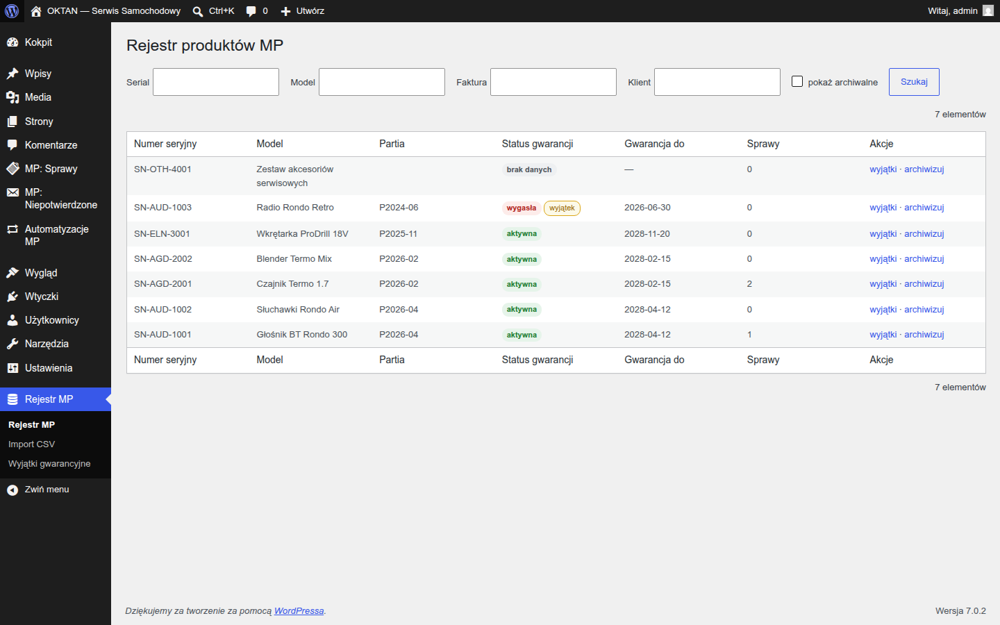
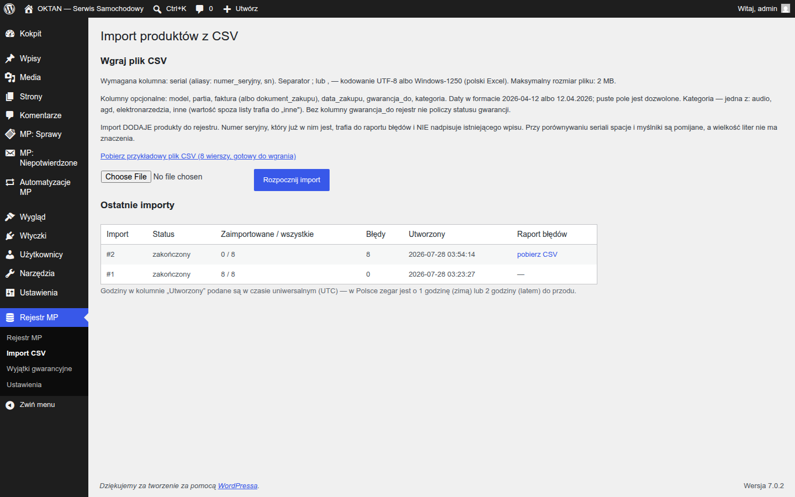
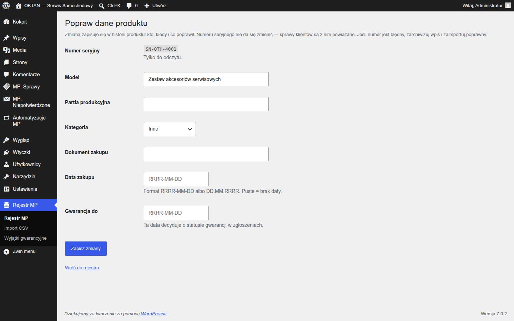
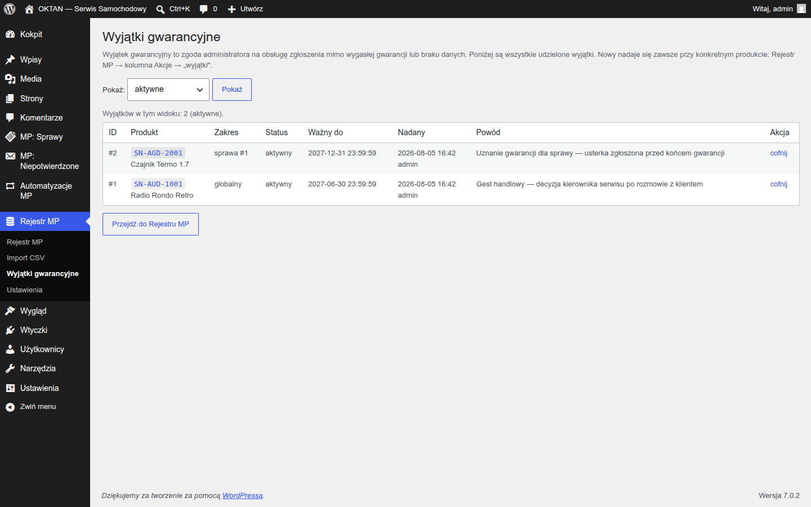

# Instrukcja: ADMINISTRATOR SYSTEMU

> Dla właściciela/administratora z rolą **Administrator systemu MP** (lub konta administratora WP).
> Masz wszystko, co koordynator (patrz `KOORDYNATOR.md`), plus rejestr produktów, import,
> wyjątki gwarancyjne i utrzymanie.

## 1. Instalacja i pierwsza konfiguracja

Krok po kroku w **`INSTRUKCJA-KLIENTA.md`** (instalacja 3 ZIP-ów, co powstaje automatycznie,
konfiguracja formularza, rejestru i Automatora, noty serwerowe: SMTP, nginx, systemowy cron).

### ⚠️ Zrób to zaraz po instalacji: wskaż, kto dostaje zgłoszenia

Świeżo zainstalowany system **nie przydziela spraw nikomu**, dopóki nie wskażesz pracowników.
Sprawy będą się poprawnie przyjmować, ale zostaną „nieprzydzielone".

1. **Użytkownicy → Dodaj nowego** — załóż konta pracownikom serwisu z rolą **„Pracownik serwisu MP"**
   (dokładnie tak nazywa się na liście ról).
2. **Automatyzacje MP** → przewiń pod tabelę reguł do sekcji **„Kto dostaje zgłoszenia"**.
3. Zaznacz osoby, między które system ma rozdzielać sprawy (po kolei, sprawiedliwie), i kliknij
   **Zapisz listę pracowników**.

Tę listę ustawia **wyłącznie administrator systemu** — koordynator widzi ostrzeżenie o pustej liście,
ale nie może jej zmienić. Kontrolnie: **Narzędzia → Stan witryny** przestanie zgłaszać pustą pulę,
a w tabeli reguł zamiast ostrzeżenia pojawią się imiona pracowników.

## 1a. Ekrany „Ustawienia" — co ustawisz sam, bez programisty

Każda z trzech wtyczek ma własny ekran **Ustawienia**. Najważniejszy jest ten w Automatorze.

**Automatyzacje MP → Ustawienia** — cztery sekcje, **każdą zapisuje się osobnym przyciskiem**:

| Sekcja | Co ustawiasz |
|---|---|
| **Statusy własne** | dokładasz własne statusy obok siedmiu wbudowanych: klucz techniczny, nazwa widoczna, czy aktywny, czy kończy sprawę, termin w godzinach i moment ostrzeżenia. Siedmiu wbudowanych nie da się usunąć |
| **Godziny terminów (statusy wbudowane)** | ile godzin sprawa może stać w danym statusie, zanim minie termin. Priorytet wysoki skraca termin o połowę, niski podwaja. Statusy „odrzucone" i „zamknięte" terminu nie mają |
| **Reguły przydziału i powiadomień** | dokładasz i wyłączasz reguły: KIEDY → JEŚLI → ZRÓB, z numerem kolejności. Pole **„Szczegóły akcji" to zapis JSON** (wzory pod polem, np. `{"new_status":"w analizie"}`); reszta to listy wyboru. ⚠️ Warunki **„kraj" i „język" nie zadziałają** — produkt nigdzie tych danych nie zbiera, więc reguła oparta na nich nie dopasuje żadnej sprawy. Ekran mówi to wprost |
| **Kasowanie danych przy odinstalowaniu** | czy odinstalowanie wtyczki ma skasować dane. **Domyślnie wyłączone** |

**MP: Sprawy → Ustawienia** — dwie sekcje, każda z własnym przyciskiem:

| Sekcja | Co ustawiasz |
|---|---|
| **Powody odrzucenia sprawy** | lista powodów, z której pracownik wybiera przy odrzuceniu. **Sześć powodów działa od razu po instalacji** — tu je dopasujesz do swojego serwisu (jeden powód w linii). ⛔ **Pustej listy system nie przyjmie**: bez powodów nie dałoby się odrzucić żadnej sprawy |
| **Kasowanie danych przy odinstalowaniu** | czy odinstalowanie tej wtyczki ma skasować jej dane. **Domyślnie wyłączone** |

**Rejestr MP → Ustawienia** ma jedną sekcję: kasowanie danych przy odinstalowaniu tej wtyczki
(też domyślnie wyłączone).

> ⚠️ Zmiana godzin terminów nie przelicza sama spraw już otwartych — po zapisie użyj akcji
> **„Przelicz terminy obsługi"** w panelu automatyzacji.

## 2. Rejestr produktów i gwarancji

**Rejestr MP** — baza produktów, numerów seryjnych, partii i okresów gwarancyjnych; wyszukiwarka
po serialu / kliencie / fakturze / modelu:

**Import CSV** (Rejestr MP → Import CSV) — porcjami, ze wznawianiem i raportem błędów per wiersz;
na ekranie jest przykładowy plik do pobrania i lista kolumn:

Produktów **nie usuwa się z rejestru w ogóle** — dostępne akcje to: historia, wyjątki, poprawa
danych i **archiwizacja**. Produktu z **aktywną sprawą nie da się zarchiwizować** — system celowo
na to nie pozwala, żeby otwarta sprawa nie została bez produktu, którego dotyczy (nazywamy to
blokadą integralności). Najpierw zamknij sprawę, dopiero potem archiwizuj (produkt archiwalny
nie przyjmuje nowych zgłoszeń).

### Poprawianie danych produktu

Jeśli w pliku importu była pomyłka (najczęściej data gwarancji), kliknij przy produkcie
**„popraw dane"**. Możesz zmienić model, partię, kategorię, dokument zakupu, datę zakupu
i datę końca gwarancji. Daty przyjmujemy w formacie `RRRR-MM-DD` albo `DD.MM.RRRR`.

Co się dzieje po zapisaniu:

- **zmiana od razu wpływa na zgłoszenia** — jeśli poprawisz datę gwarancji, produkt przestaje
  być „po gwarancji" i kolejne zgłoszenia dostają właściwy status;
- **zmiana zapisuje się w historii produktu**: kto, kiedy i co poprawił (wartość przed i po).
  Wyjątek: przy dokumencie zakupu zapisujemy sam fakt zmiany bez treści — to dana osobowa;
- **numeru seryjnego nie da się zmienić.** To po nim sprawy klientów trzymają się produktu —
  podmiana przepisałaby cudzą historię serwisową na inny egzemplarz. Jeśli numer jest błędny,
  zarchiwizuj wpis i zaimportuj poprawny.

Odrzucimy zapis, gdy data jest niepoprawna albo gwarancja kończy się **przed** datą zakupu —
zobaczysz wtedy komunikat i wrócisz do formularza z wpisanymi danymi.

Produkt w archiwum jest zablokowany do edycji — najpierw go przywróć.

## 3. Wyjątki gwarancyjne (tylko Ty)

Ręczne przyznanie lub cofnięcie gwarancji dla produktu albo konkretnej sprawy (np. gest dobrej
woli po terminie). Każdy wyjątek ma powód (notatka wewnętrzna — klient jej nie widzi). W historii
produktu zostaje wpis o nadaniu i cofnięciu wyjątku, ale **bez treści powodu** — dziennik zdarzeń
celowo nie przechowuje notatek ani danych osobowych; powód znajdziesz na liście wyjątków.

**Jak tu wejść:** wyjątek dotyczy zawsze **konkretnego produktu**, więc otwiera się go z listy —
**Rejestr MP → Rejestr MP**, znajdź produkt i w kolumnie **Akcje** kliknij **„wyjątki"**.

> ℹ️ W menu bocznym jest też pozycja **Wyjątki gwarancyjne**. Wejście przez nią, bez wskazania
> produktu, pokazuje **listę wszystkich udzielonych wyjątków** — produkt, zakres, status, do kiedy
> ważny, kto i kiedy go nadał, powód oraz akcję „cofnij". Filtrem u góry wybierasz: aktywne
> (domyślnie), przeterminowane, cofnięte albo wszystkie. Nowy wyjątek nadaje się nadal przy
> konkretnym produkcie — z Rejestru, jak wyżej.

## 4. RODO — obowiązki administratora

- Wnioski o **eksport/usunięcie danych**: wbudowane narzędzia WordPressa
  (**Narzędzia → Eksport / Usuwanie danych osobowych**) obejmują dane systemu serwisowego.
- Usuwanie = **anonimizacja**, czyli dane osobowe znikają, ale sprawa zostaje. Konkretnie
  **znika**: imię i nazwa klienta, telefon, adres e-mail (zastąpiony technicznym `anon-…@removed.invalid`),
  powiązanie z kontem na stronie, treść wiadomości oraz pola zgłoszenia zawierające dane osobowe
  (w ich miejscu widać `[ZREDAGOWANO-RODO]`). **Zostaje**: sama sprawa, jej numer, statusy, daty
  i oś zdarzeń — dzięki temu statystyki i historia serwisu dalej się zgadzają, ale nie da się już
  ustalić, czyja to była sprawa. Przy aktywnej sprawie — odroczenie do jej zamknięcia.
- **Wspólny adres wielu osób** (sekretariat): narzędzie WordPressa „Usuń dane osobowe" działa po adresie e-mail i obejmie wszystkie kartoteki
  z tego adresu — przed uruchomieniem potwierdź tożsamość i zakres wniosku.
- 🔴 **Notatki wewnętrzne personelu WCHODZĄ do paczki wydawanej klientowi.** Wniosek o dostęp
  do danych (art. 15 RODO) obejmuje także **opinie o osobie**, więc notatka pracownika o kliencie
  jest daną tego klienta i musi zostać wydana — w paczce jest opisana jako *„notatka wewnętrzna
  personelu (nie była wysyłana do klienta)"*. **Uprzedź o tym zespół**: notatka jest niewidoczna
  w panelu klienta i nie idzie mailem, ale **przy wniosku RODO klient ją przeczyta**.
- Retencja załączników i sprzątanie danych tymczasowych chodzą automatycznie (cron).

## 5. Utrzymanie

- **Narzędzia → Stan witryny** — 16 testów systemu (poczta zgłoszeń i automatu, załączniki, HTTPS, pula przydziału,
  wykonywanie się crona, sprawy poza automatyzacją, sprawy krążące bez końca, treści fabryczne WordPressa…). Zielono = zdrowo; czerwono = instrukcja
  naprawy w treści testu.
- **Aktualizacje wtyczek**: standardowo przez ZIP; migracje bazy wykonują się same przy wejściu
  do panelu, crony odtwarzają się same, a **terminy spraw już otwartych przeliczają się
  automatycznie** — nie musisz po aktualizacji klikać „Przelicz terminy obsługi". Przed aktualizacją
  na produkcji zrób kopię bazy (polityka: `MIGRATION_POLICY.md` — w głównym katalogu paczki).
- **Odinstalowanie** sprząta role systemowe (4 role), automatycznie założone strony (2), zadania
  cykliczne oraz **wszystkie pliki robocze**: załączniki ze zgłoszeń, a także pliki wsadowe
  i raporty błędów z importu produktów — nic z tego nie zostaje na dysku serwera. **16 tabel z danymi (klienci, sprawy, wiadomości, zgody)**
  oraz wpisy niepotwierdzonych zgłoszeń **zostają w bazie** — to świadoma decyzja, żeby
  przypadkowe odinstalowanie wtyczki nie skasowało danych biznesowych. Zostają też konta
  klientów założone przez system (bez roli). Uwaga: narzędzie do kasowania tych danych
  (obsługa wniosków RODO) znika razem z wtyczką — jeśli firma chce dane klientów usunąć,
  trzeba to zrobić **przed** odinstalowaniem, nie po.
