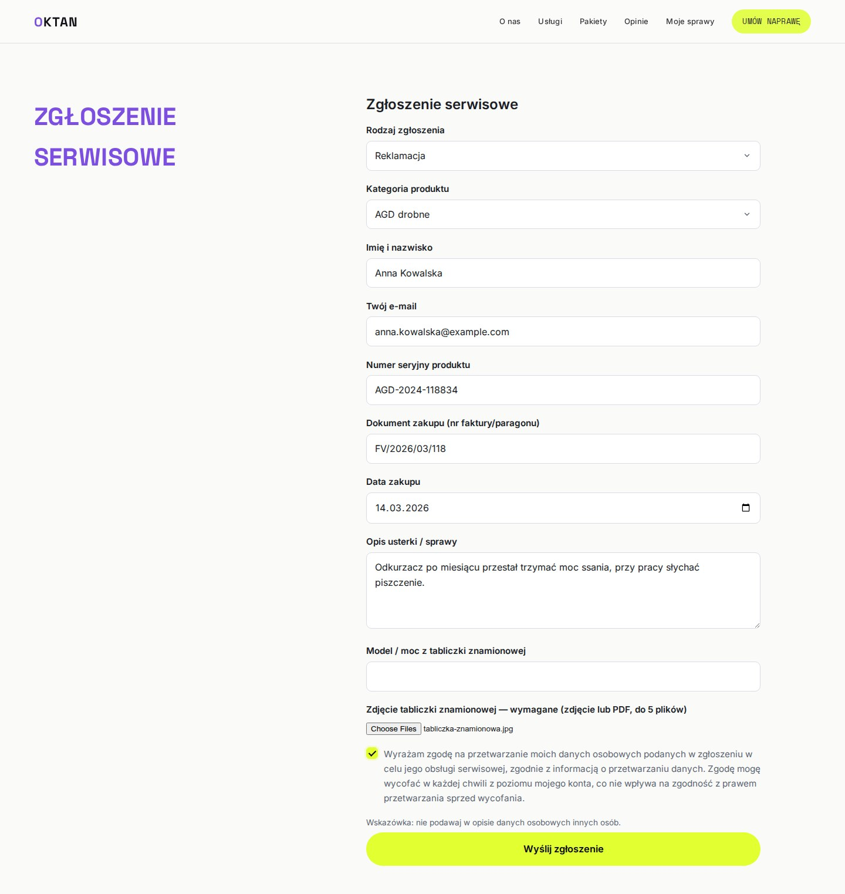
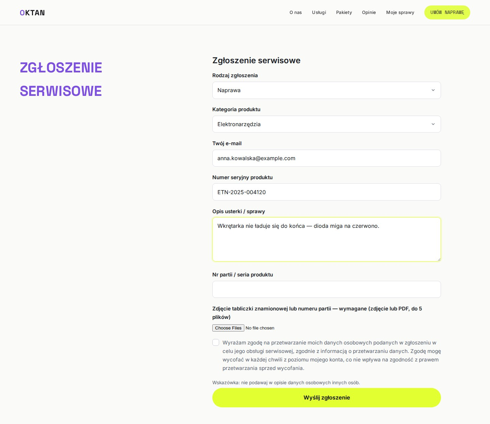
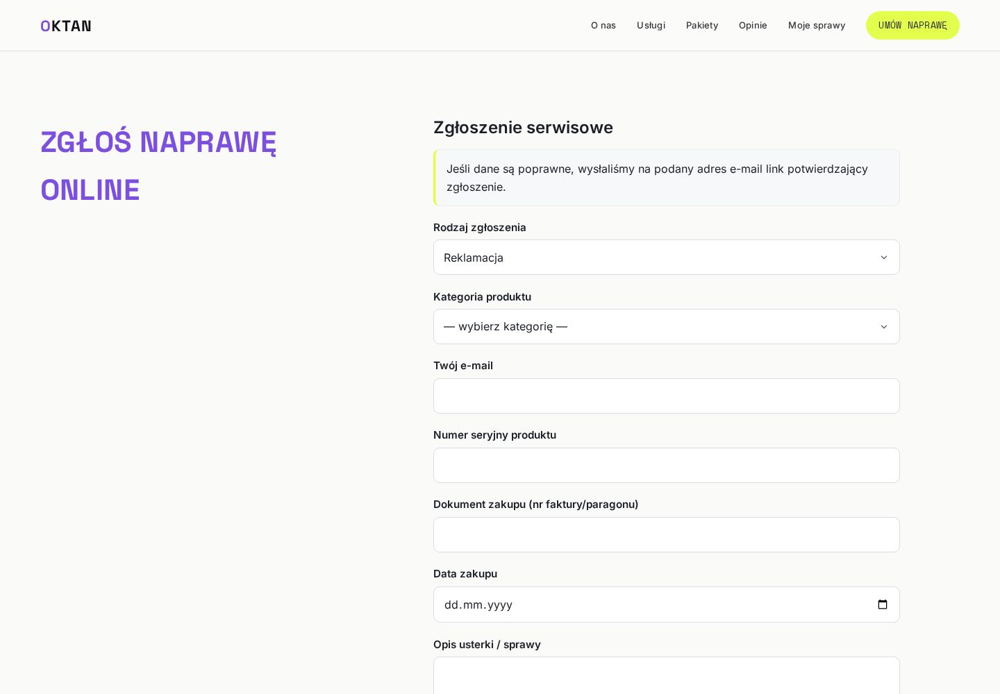
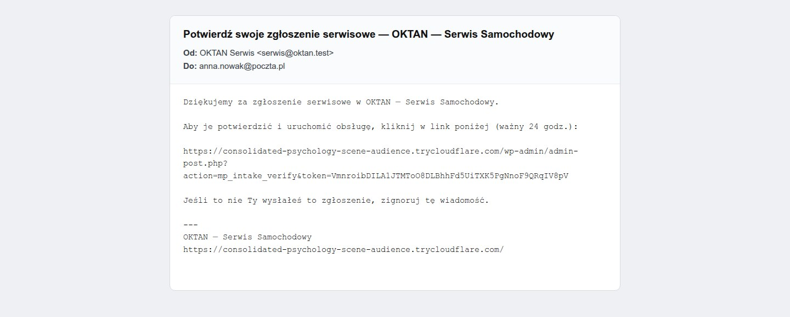
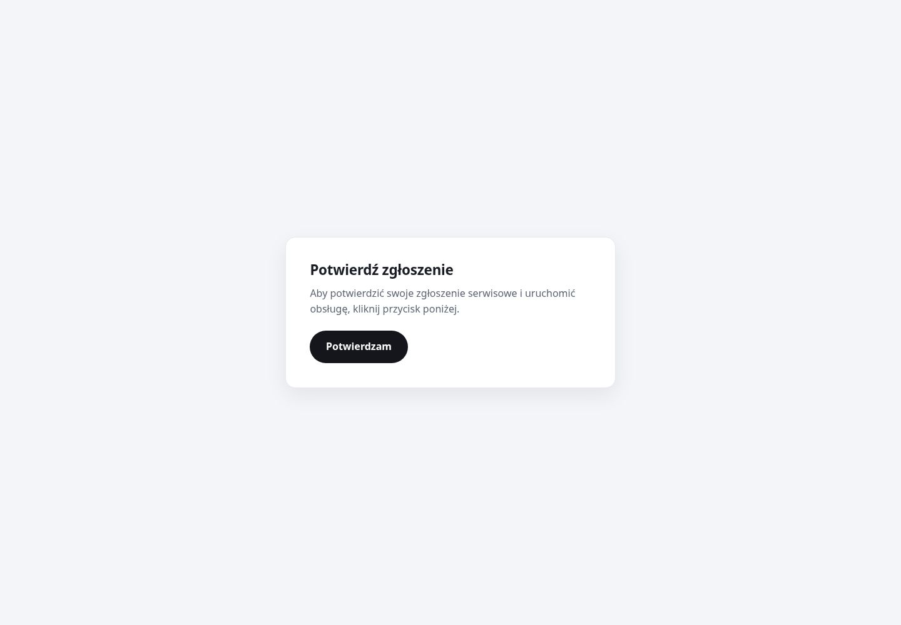
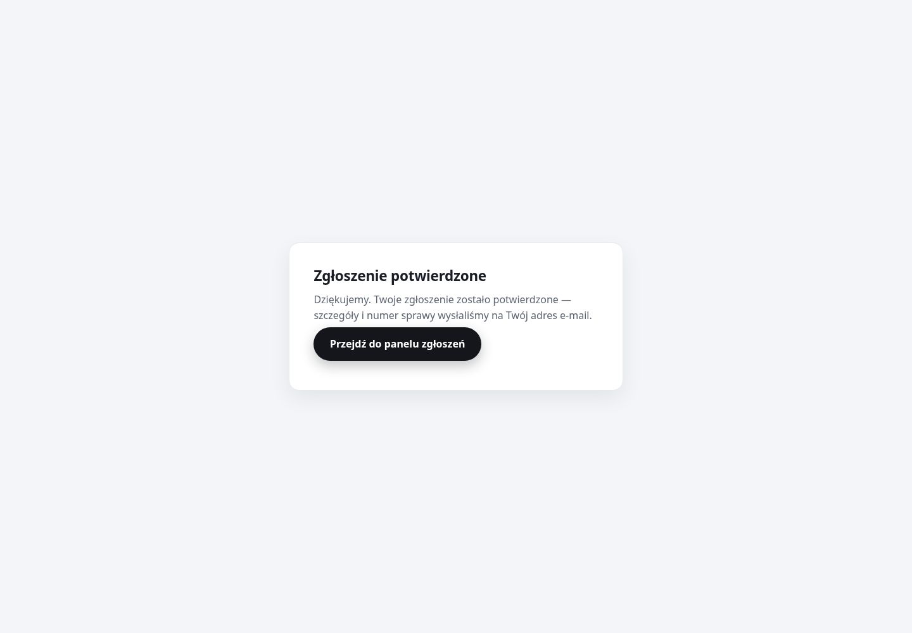
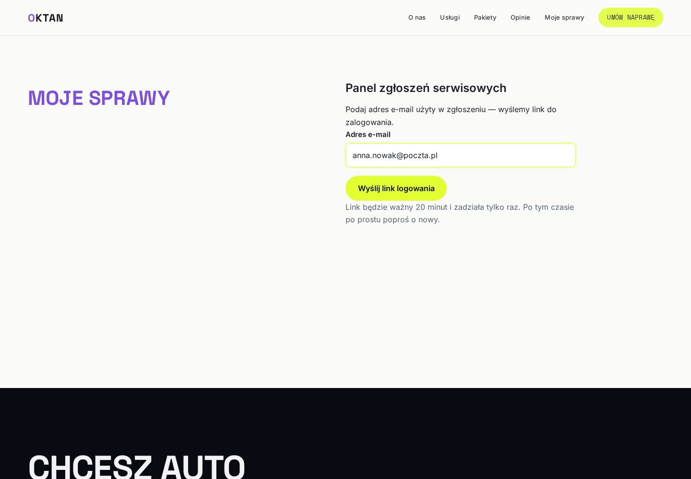
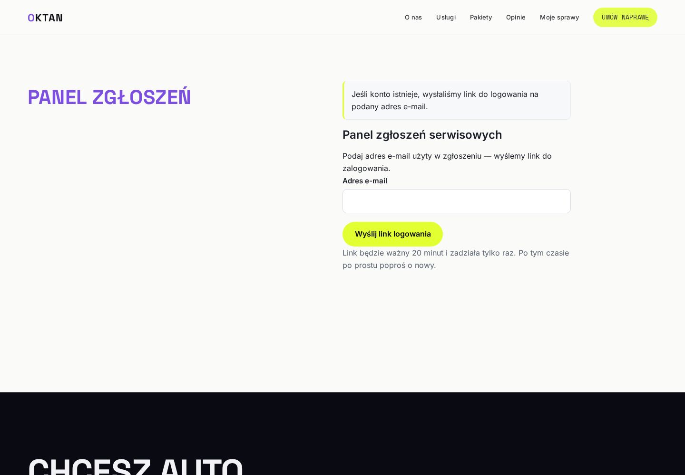
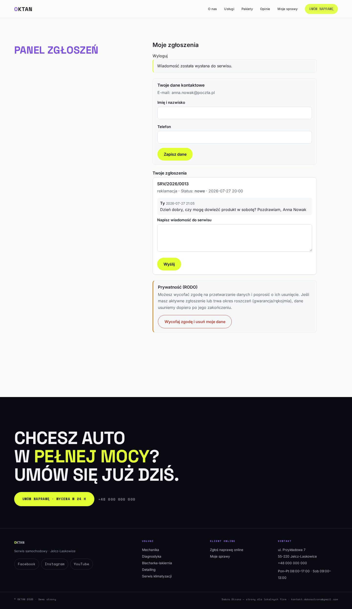
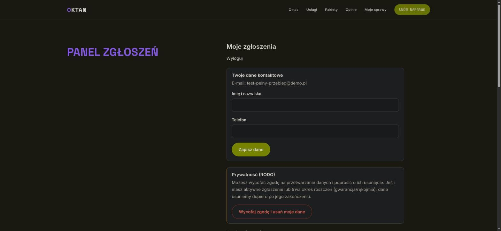

# Instrukcja: KLIENT (zgłaszający)

> Dla osoby, która kupiła produkt i chce zgłosić reklamację, naprawę, zwrot albo zadać pytanie.
> Nie potrzebujesz konta ani hasła — wszystko dzieje się przez e-mail.

## 1. Wyślij zgłoszenie

Wejdź na stronę **„Zgłoszenie serwisowe"**. U góry, w polu **„Rodzaj zgłoszenia"**, wybierz typ
sprawy — formularz sam dopasuje pola (reklamacja pyta o numer seryjny, dokument i datę zakupu;
pytanie techniczne — tylko o opis).

Podaj **imię i nazwisko** oraz **e-mail** — po nich serwis rozpozna, czyja to sprawa. Ma to
znaczenie zwłaszcza wtedy, gdy kilka osób zgłasza z jednej wspólnej skrzynki (np. sekretariat):
każda osoba ma wtedy **własną kartotekę** (rozróżniamy po imieniu i nazwisku), ale panel jest
przypięty do **adresu e-mail** — po zalogowaniu wspólną skrzynką zobaczysz **wszystkie zgłoszenia
wysłane z tej skrzynki**, także innych osób. Kto ma dostęp do skrzynki, ten widzi jej sprawy —
jeśli zgłoszenia mają być rozdzielone, każda osoba powinna podać **własny adres**.

Wypełnij pozostałe pola, w razie potrzeby **dodaj zdjęcie lub PDF** (np. dowód zakupu, zdjęcie
usterki) i zaznacz zgodę na przetwarzanie danych. Kliknij **„Wyślij zgłoszenie"**.

Dla kategorii **AGD drobne** i **Elektronarzędzia** załącznik jest **wymagany** — dodaj zdjęcie
tabliczki znamionowej (albo numeru partii), inaczej serwis nie ustali modelu ani mocy urządzenia.
Dla **Elektroniki audio** i **Inne** załącznik jest opcjonalny. Dozwolone formaty: JPG, PNG,
WebP, PDF, maksymalnie 5 plików. Jeśli zdjęcie jest za duże, system napisze wprost, **do ilu
megabajtów** ten serwer przyjmuje pliki — wyślij mniejsze (np. pomniejsz zdjęcie w telefonie).
Przy kategorii z wymaganym załącznikiem zgłoszenie poczeka na poprawny plik; przy pozostałych
przejdzie, a Ty zobaczysz informację, że plik nie został dołączony.

Przy innym rodzaju sprawy formularz wygląda inaczej — to celowe:

Po wysłaniu zobaczysz neutralne potwierdzenie:

## 2. Potwierdź zgłoszenie mailem (ważne!)

Na Twój adres przychodzi e-mail z przyciskiem potwierdzenia. **Bez potwierdzenia zgłoszenie nie
trafi do serwisu** (to ochrona przed spamem i pomyłkami w adresie).

Kliknij link → otworzy się strona z przyciskiem **„Potwierdzam"**:

Po potwierdzeniu dostaniesz mail z **numerem sprawy** (np. `SRV/2026/00012`) — zachowaj go.

## 3. Panel klienta — status i rozmowa z serwisem

Wejdź na stronę **„Panel zgłoszeń"** i podaj swój e-mail — dostaniesz **link do zalogowania**
(bez hasła; link jest jednorazowy i ważny 20 minut — po tym czasie po prostu poproś o nowy).

W panelu widzisz **swoje sprawy, ich statusy i historię wiadomości**. Możesz napisać do serwisu
przy każdej sprawie:

O każdej ważnej zmianie (przydział, zmiana statusu, decyzja) system powiadomi Cię e-mailem.

## 4. Twoje dane (RODO)

Dane kontaktowe poprawisz na górze panelu. Sekcja **Prywatność (RODO)** — wycofanie zgody
i usunięcie danych — jest **na samym dole**, pod Twoimi zgłoszeniami:

**Usunięcie danych wymaga dwóch kliknięć — przypadkiem tego nie zrobisz.** Po kliknięciu
„Wycofaj zgodę i usuń moje dane" zobaczysz ekran, który mówi wprost, co zniknie, co zostanie
i że tej operacji **nie da się cofnąć**. Dopiero przycisk na tym ekranie ją wykonuje, a obok
jest „Anuluj":

- Jeśli masz **aktywną sprawę**, dane zostaną usunięte po jej zakończeniu (system to jasno powie).
- Jeśli z jednego adresu e-mail korzysta **kilka osób** (np. sekretariat), samoobsługowe usuwanie
  jest wyłączone — napisz wiadomość w swojej sprawie, wniosek rozpatrzy pracownik.

## Najczęstsze pytania

| Pytanie | Odpowiedź |
|---|---|
| Nie dostałem maila potwierdzającego | Sprawdź spam; upewnij się, że adres był poprawny. Możesz wysłać zgłoszenie jeszcze raz — ale **identyczne** ponowienie w ciągu 15 minut system odbije jako duplikat, więc odczekaj kwadrans albo minimalnie zmień opis. |
| Link do logowania „nieaktualny" | Link żyje 20 minut i działa raz — poproś o nowy na stronie panelu. |
| Wysłałem zgłoszenie dwa razy | System sam łapie duplikaty — drugie identyczne zgłoszenie w krótkim czasie nie tworzy nowej sprawy. |
| „Zbyt wiele zgłoszeń" — nie mogę wysłać kolejnego | To ochrona przed spamem, nie awaria. Z jednego adresu e-mail można wysłać **3 zgłoszenia na dobę**, a dla jednego numeru seryjnego — 5. **Doba liczy się od pierwszego z tych zgłoszeń**, więc jeśli wysłałeś je wieczorem, odblokujesz się następnego dnia **o tej samej porze**, a nie rano. Nie czekaj bezczynnie — **napisz wiadomość w sprawie, którą już masz założoną**; to trafia do serwisu od razu i nie podlega limitowi. |
| Zmieniłem adres na `moj+cos@…` i dalej nie mogę wysłać | Adresy z plusem to dla systemu **ten sam adres** (poczta i tak idzie do jednej skrzynki), więc liczą się do jednego limitu. To działa zgodnie z zamierzeniem — patrz wiersz wyżej. |
| Chcę dosłać zdjęcie do sprawy | Napisz wiadomość w sprawie w panelu — serwis się odezwie. |
