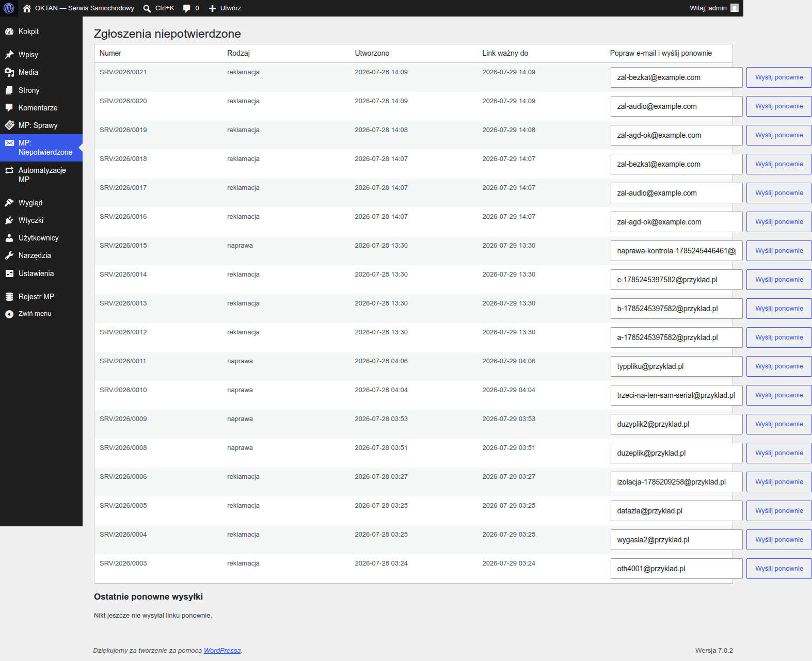

# Instrukcja: KOORDYNATOR SERWISU

> Dla kierownika zespołu z rolą **Koordynator serwisu MP**. Widzisz wszystkie sprawy, rozdzielasz
> pracę, konfigurujesz automatyzację i pilnujesz terminów zespołu.

## 1. Wszystkie sprawy zespołu

**MP: Sprawy** — pełna lista z filtrami (status / rodzaj / przydzielony) i wyszukiwarką po numerze
sprawy lub kliencie. Czerwony termin SLA = wymaga uwagi. „Nieprzydzielona" na czerwono = sprawa,
której automat nie umiał przydzielić (najczęściej pusta pula — patrz §3).

> **SLA** to umówiony czas na zajęcie się sprawą (np. 24 godziny na pierwszą reakcję). System
> pilnuje go sam: przypomina pracownikowi przed upływem, a po terminie eskaluje do Ciebie —
> szczegóły w §4.

Na karcie sprawy możesz: **przydzielić / prze-przydzielić** pracownika, zmienić status i priorytet,
pisać do klienta. Ponowne przydzielenie tej samej osobie nic nie wysyła (bez spamu).

Wynik sprawdzenia gwarancji ma cztery statusy: aktywna / wygasła / brak danych / **wymagana
weryfikacja**. Ten ostatni znaczy, że numer dokumentu zakupu albo data zakupu od klienta nie
zgadzają się z rejestrem — sprawa NIE jest automatycznie odrzucana. Poproś pracownika o
sprawdzenie dokumentu zakupu z klientem; jeśli sprawa jest zasadna mimo niezgodności w
rejestrze, poproś **administratora systemu** o nadanie wyjątku gwarancyjnego. Wyjątki zatwierdza
wyłącznie administrator — koordynator ich nie nadaje.

Uwaga przy przydzielaniu: na liście „Przydziel do" są **tylko pracownicy serwisu**. Koordynatorzy
i administratorzy nie prowadzą spraw, więc nie da się na nich przydzielić sprawy.

## 2. Zgłoszenia niepotwierdzone

**MP: Niepotwierdzone** — zgłoszenia, których klient jeszcze nie potwierdził mailem. Nie obsługuje
się ich (mogą być pomyłką lub spamem). Link potwierdzający jest ważny **72 godziny**, więc po tym
czasie takie zgłoszenie i tak nie może już ruszyć, a **po 30 dniach znika razem z danymi**.

Kolumna **„Poczta"** pokazuje, czy link potwierdzający w ogóle wyszedł. Oznaczenie
**„⚠ Link NIE doszedł"** znaczy, że wysyłka maila padła po stronie serwera — klient nie dostał
nic i nie ma czego potwierdzić, więc **samo czekanie nic nie da**. W takim wypadku sprawdź
**Narzędzia → Stan witryny** (sekcja poczty), a po naprawie użyj przy zgłoszeniu akcji
**„popraw e-mail i wyślij ponownie"** — przy okazji poprawisz literówkę w adresie. Ponowną
wysyłkę dla tej samej sprawy można wywołać **raz na 5 minut**.

## 3. Automatyzacja — Twój panel sterowania

**Automatyzacje MP** (menu boczne):

- **Reguły przydziału** — tabela pokazuje, co automat robi i kiedy (tylko do odczytu). Pod nią
  jest sekcja **„Kto dostaje zgłoszenia"** z listą pracowników do zaznaczenia — **ustawia ją
  administrator systemu** (tak samo jak pozostałe konfiguracje). **Pusta lista = sprawy zostają
  nieprzydzielone**, a tabela reguł mówi o tym wprost. Jeśli widzisz to ostrzeżenie, poproś administratora.
- **Akcje**: „Przelicz terminy obsługi" (po zmianie konfiguracji terminów; nie wysyła ponownie starych
  powiadomień) i „Eksport CSV" (zestawienie: liczba spraw, czas obsługi, powody odrzuceń).
- **Statusy spraw** — 7 wbudowanych i nieusuwalnych. **Własne statusy dokłada administrator**
  w **Automatyzacje MP → Ustawienia** (sekcja „Statusy własne"); tam też ustawia się **godziny
  terminów** dla każdego statusu. Programista nie jest do tego potrzebny.
- **Rejestr zdarzeń** — co automat zrobił i dlaczego (np. `ASSIGNMENT_UNMATCHED` = nie umiał
  przydzielić). Przycisk „Pokaż techniczne" odsłania też wpisy cyklicznego sprawdzania.
- **Checklisty i szablony odpowiedzi** — kroki obsługi per rodzaj sprawy i gotowe treści maili;
  w treściach działają wyłącznie markery z listy pod edytorem (np. `{{numer_sprawy}}`,
  `{{status}}`) — inne są pomijane.

## 4. Terminy zespołu (SLA)

- Przypomnienia przed terminem idą do przypisanego pracownika; **eskalacje po terminie — do
  Ciebie**.
- Sprawy nieprzydzielone też eskalują do Ciebie (nic nie ginie w próżni).
- **Przy większej liczbie zaległości dostajesz jedną zbiorczą wiadomość**, a nie osobny mail
  od każdej sprawy — np. po dłuższej przerwie w pracy serwera. Lista spraw jest w treści.
- Wznowienie **zamkniętej** sprawy to wyłącznie Twoja decyzja (Ty albo administrator; zawsze
  do statusu „w analizie", z czystym terminem).

## 5. Kondycja systemu

**Narzędzia → Stan witryny** — testy systemu mówią m.in.: czy przydział ma pracowników w puli,
czy sprawdzanie terminów **naprawdę się wykonuje** (nie tylko jest zaplanowane), czy żadna
potwierdzona sprawa nie utknęła poza automatyzacją. Czerwone = do działania, każda pozycja ma
instrukcję naprawy.
