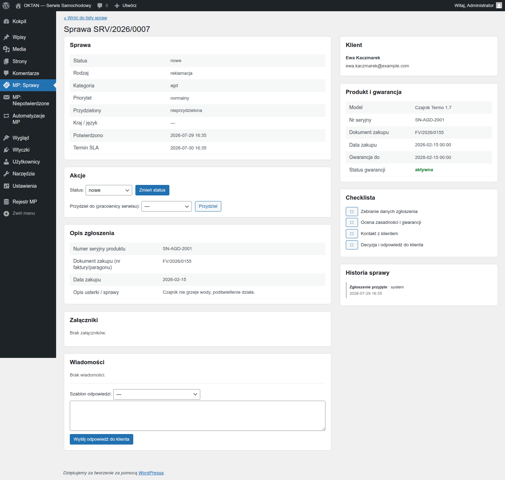

# Instrukcja: PRACOWNIK SERWISU

> Dla serwisanta z rolą **Pracownik serwisu MP**. Obsługujesz sprawy, które system (albo koordynator)
> Ci przydzielił.

## 1. Twoje sprawy

Panel WordPress → **MP: Sprawy**. Filtr **„Moje sprawy"** (lista rozwijana obok wyszukiwarki) pokazuje tylko Twoje sprawy.
Kolumny: numer sprawy, czego dotyczy, klient, rodzaj, status (kolorowa plakietka), przydzielony,
termin SLA (**czerwony** = po terminie, **bursztynowy** = blisko terminu, mniej niż 24 h), utworzono. **Priorytet sprawy widzisz po jej
otwarciu** — na karcie, nie na liście.

> **SLA** to umówiony czas na zajęcie się sprawą (np. 24 godziny na pierwszą reakcję). System
> pilnuje go sam — szczegóły w punkcie 3.

## 2. Karta sprawy — tu się pracuje

Kliknij numer sprawy. Na karcie masz wszystko:

- **Dane zgłoszenia** i wynik sprawdzenia gwarancji (z rejestru, z chwili zgłoszenia) — status:
  aktywna / wygasła / brak danych / **wymagana weryfikacja**. Ten ostatni pojawia się, gdy numer
  dokumentu zakupu albo data zakupu podane przez klienta nie zgadzają się z rejestrem. To NIE
  jest automatyczne odrzucenie — sprawdź dokument zakupu bezpośrednio z klientem; jeśli
  potwierdzi się, że towar jest na gwarancji, poproś administratora systemu o nadanie wyjątku
  gwarancyjnego (tylko administrator ma do tego uprawnienie),
- **Oś zdarzeń** — pełna, nieusuwalna historia (kto, co, kiedy),
- **Checklista** dla rodzaju sprawy — odhaczaj kroki w miarę pracy; każde odhaczenie zapisuje się
  w historii,
- **Wiadomości** — rozmowa z klientem; możesz użyć gotowego szablonu odpowiedzi (pola typu numer
  sprawy podstawiają się same),
- **Zmiana statusu** — prowadź sprawę po statusach (nowe → w analizie → … → zamknięte).
  **Odrzucenie wymaga wybrania powodu** z listy — pole powodu jest widoczne na stałe obok
  listy statusów, a wypełnić trzeba je przy statusie „odrzucone": bez tego zapis się nie uda. Lista jest gotowa od instalacji; jeśli brakuje w niej
  powodu, który u Was występuje, poproś administratora systemu o dopisanie
  (**MP: Sprawy → Ustawienia**).

Zmiana danych kontaktowych przez klienta **zostawia ślad na osi zdarzeń** (sam fakt i nazwy
zmienionych pól, bez wartości — numer telefonu jest daną osobową). Zanim zadzwonisz pod numer
z góry karty, rzuć okiem na oś: jeśli klient go poprawił, dzwonisz pod stary.

## 3. Terminy (SLA)

- Przy każdej otwartej sprawie widzisz **termin bieżącego statusu** — „pierwsza reakcja" dotyczy
  statusu „nowe"; każdy kolejny status (np. „w analizie", „w naprawie") ma własną liczbę godzin.
- **Przed terminem** system wyśle Ci przypomnienie mailem. **Po terminie** sprawa eskaluje
  do koordynatora — nie chowaj trudnych spraw, po prostu pisz do klienta i zmieniaj statusy.
- ⏸️ **Gdy przestawisz sprawę na „do uzupełnienia", zegar STAJE** — czekamy wtedy na klienta
  (zdjęcie, dokument, odpowiedź) i nie liczymy tego czasu Tobie. W kolumnie terminu i na karcie
  zobaczysz napis **„czeka na klienta"** zamiast daty. **To nie jest awaria ani zgubiony termin.**
  Zegar rusza od nowa, gdy przestawisz sprawę na status roboczy.
  ⚠️ Sprawa nie znika przez to z radaru — osobna miara pokazuje, jak długo w ogóle stoi.
  Używaj tego statusu wtedy, gdy naprawdę czekasz na klienta, a nie żeby zatrzymać termin.

## 4. Eksport

Eksport zestawień do pliku CSV robi **koordynator albo administrator** — Ty go nie zobaczysz.
To celowe: plik z listą spraw zawiera dane osobowe klientów, więc wychodzi z systemu tylko
przez osobę, która za to odpowiada. Potrzebujesz zestawienia — poproś koordynatora.

## Zasady, które system egzekwuje za Ciebie

- Nie zobaczysz spraw, których nie masz prawa widzieć — na liście spraw są **wyłącznie
  sprawy przydzielone Tobie**. Wszystkie sprawy widzi koordynator i administrator systemu.
- Zamkniętej sprawy nie wznowisz — to decyzja koordynatora.
- Wiadomość klienta na zamkniętej sprawie jest dozwolona i trafi do Ciebie mailem — status się
  nie zmienia.
- Dwuklik (podwójne wysłanie wiadomości, ponowny przydział) nie robi duplikatów.
